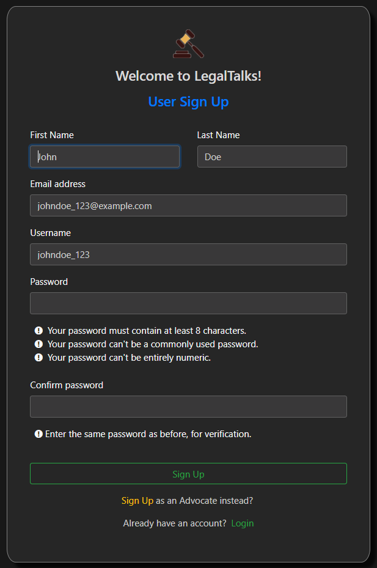

# LegalTalks

**Legal Talks is a Q&amp;A platform where anyone having a legal query can get satisfying and appropriate answers and suggestions from certified lawyers. Anyone who has a legal query can ask the query in concerned domain (such as Property, Finance, Disputes, Criminal Offense, etc.) and certified lawyers can answer and provide guidance to the query, leaving the choice to the querier to select the appropriate response for his query.**

## 1) Navbar

Navigation bar Contains Following Elements starting from left :

-	Logo of Legal Talks
-	Home Page nav
-	Your Content nav
-	Profile nav
-	Add Question Button
-	Search Bar
-	Login and Signup options
- About Nav

## 2) Question Card

Every Question has a separate card which will contain following :

-	Querier Info Profile Picture and Username
-	Question asked date for example 18 May, 2021
-	Category of the Question for example Business Law, Civil Law, Consumer Law etc.
- Question Title
- Question Detail
-	Report Button which can be used report the question if user feels it is inappropriate in anyway.
-	Upvote-Downvote button which can be a great indicator that this question helped people.
-	Answer Button which can be used to answer the question
-	Count of the answers the question has received.

## 3) Homepage

Legal Talks Homepage contains :

-	Navbar for easy navigation to all the pages of website
-	What is your question card
-	Question Card
-	Filter Categories Section

## 4) Filter Categories Feature

Each Question has one category such as Business Law, Civil Law, Consumer Law, Criminal Law which can be used to filter the questions as the user wish
Filter Categories can be used to the select multiple categories at time for filtering the questions it is very useful for users who wants see the question related the only specific Law. By default it is collapsed so for viewing the categories user have press on the Filter Categories button.

## 5) User Sign Up

It Contains Fields such as First Name, Last Name, Email, Username, Password and Confirm password.

  ### Extra User Details
  
  
  
  This page will contain the extra details of user such as Gender, Date of Birth and Profile.
  But the Profile picture Field is optional.

  
## 6) Lawyer Sign Up

Lawyer must have cleared the Bar Examination for Signing Up on the Platform.
We have read only access to the Bar Enrolment number and their connected email from the Bar Council of India. 

The Lawyer just have to enter their Bar Enrolment Number and the email verification code will be sent to their linked email ID so that we can verify that lawyer is not using anyone else’s Bar number and trying to Sign Up into the platform.

  ### A) Bar Enrollment Number
  
  
  On this page the lawyer has to enter their valid Bar Enrolment Number. After Entering a valid a Bar Enrolment Number. The Lawyer will redirected to the Email           verification page
  
  ### B) Email Verification
  
  
  
  After Entering the Valid Bar Enrolment Number the user will receive a 6 digit numeric code on the email which is linked to the Bar Enrolment Number. User have to       Enter that code to get verified.
  
  ### C) Advocate Sign Up
  
  
  
  After Email Verification the lawyer will get Advocate Sign Up Page where he/she have Enter Details:
  First Name, Last Name, Username, Password, Confirm Password the Email will be automatically fetched from the server side so the user don’t have to re-enter the email   id but he don’t want to use that email id for Signing up he/she can change it.
  After Entering valid credentials and clicking on Sign Up Button the Lawyer will be redirected to the Profile Details Page. 
  
  ### D) Laywer Profile Details
  
  
  
  This is the last page of Lawyer Sign Up here you just have to enter profile details:
  Gender, Date of Birth, Phone Number and Profile Picture. The Profile Picture is Optional
  

## 7) User Profile

User Profile has two page one is View Page and Other is Edit Page
On The View Page User can just view their details and cannot edit it Editing/Updating the details can be done by going to the Edit page by clicking the Edit Button it will redirect the user to the edit page. User can edit various details such as username, email, phone number, password, and profile picture

## 8) Lawyer Profile

Lawyer can view their profile by clicking on the profile nav from the navbar. Lawyer Profile also has two pages one is readonly and other is for updating the details Lawyer profile has a icon that indicates that they are a verified lawyer.
Lawyer can edit details such as username, email address, phone number, password and profile image.

## 9) Your Content

Your content page contains all the questions and answers asked and answered by the user in one place. User can use the By Content Type Filter to sort the content according to their need they can sort the questions and answers such as All Types, Questions asked, Answers. User can also filter question as Newest First and Oldest First. From Your Content page user can Edit and Delete their questions and answers by simply clicking on the Edit and Delete Button.

## 10) Question Detail View Page

By clicking on any question from homepage or your content page you will go to the detail view of that question. In which at the top there will be question card of that question and after there will be answers given by various lawyers.
On the question card there will be upvote and downvote buttons, Answer Button and report Button. If the question is he asked by you then you will also get Edit and Delete buttons there.
On the Answer card you will also have upvote and downvote buttons, and if the answer is given by you then you will also get Edit and Delete Button.

## 11) Question Search

Search on the navigation bar can be used to search for the previously asked questions. You have to Enter the keywords and click on search icon then matching question will be displayed and when you will click on the card you will be redirected to the detail view of that question.

## 12) Modals

  ### A) Add Question Modal
  
  
  
  User can Activate the Modal by clicking on Plus Button present on the navigation bar or user can simply click on the what is your question input field present on the   homepage. Both the methods will make the Question Modal Popup. 

  The question modal has Anonymous Function, Choose Category, Question Title and Question Detail Fields. User can use the Anonymous Function to hide their Identity.     User can choose any one category which fits their question from the given 10 Categories. In Question Title user can add their Question and then they can use the       Question Detail Field to explain it further. 
  
  ### B) Edit Question Modal
  
  
  
  Using Edit Question function user can Edit their previously asked questions. By Clicking on the Edit Button present on the Question Card it make Edit Question Modal   Pop-Up. In Edit Question Modal User can Edit the Title of Question and Detail Of Question.
  
  ### C) Answer Modal
  
  
  
  Answer Modal can be used to Answer the question. User can Activate the modal by clicking on the Answer Button present on any question card. Answer card only           contained one Answer text area field which can be used to write your answer.
  
  ### D) Delete Modal
  
  
  
  You can Activate the Delete Modal by clicking the Delete Button Present on the Question/Answer Card from either Your Content Page or Question Detail View Page.         Delete Modal can be used to Delete the Question asked by user/lawyer and answer given by a lawyer.
  
  ### E) Report Modal
  
  
  
  Report modal can be used for reporting the inappropriate questions. Report Modal can be activated by pressing the report Button present on the top-left side of the     question card.

## 13) Upvote and Downvote

The Upvote button is indicated by Up arrow and the Downvote button is indicated by Down arrow. The Upvote and Downvote buttons are present on every Question and Answer Cards. 
Ff user wants to upvote the question/answer user can press up arrow button or if user wants to downvote the question/answer user can click on down arrow button as per his choice. If the answer has more upvotes as compared to downvotes then counter will display positive number or else counter will display zero or negative which indicates the downvotes

  

